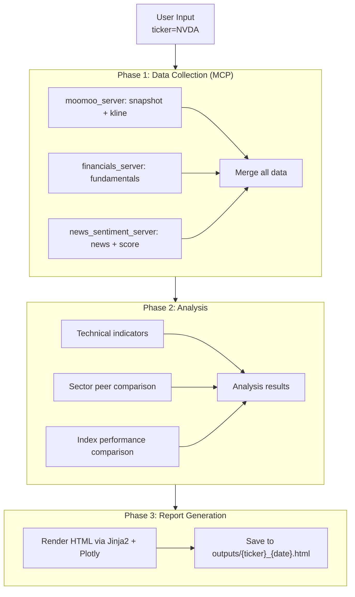

# moomoo-dashboard

A Claude Code skill that generates visual equity research reports powered by **MooMoo OpenAPI**. Input a ticker symbol, get a comprehensive HTML dashboard with real-time market data, fundamentals, sector comparison, performance benchmarks, and sentiment analysis.

---

## 1. Overview

This workflow runs inside Claude Code using **skills** (structured markdown instruction files) and **MCP servers**:

1. User invokes `/moomoo-dash NVDA`
2. Claude Code fetches real-time data from MooMoo OpenAPI via MCP
3. Supplements with financial fundamentals (yfinance)
4. Computes technical indicators (RSI, MACD, Bollinger Bands)
5. Compares performance vs index and sector peers
6. Scores news sentiment
7. Generates a single-file interactive HTML report in `outputs/`

---

## 2. Architecture



---

## 3. Quick Start

### 3.1 Prerequisites

| Requirement | Version | Notes |
|---|---|---|
| Python | 3.10+ | Required for type hints and pandas 2.x |
| Claude Code CLI | Current | Required for skill orchestration |
| MooMoo OpenD | Latest | Gateway for MooMoo API (must be running locally) |
| MooMoo Account | Any | Free account provides basic market data |

### 3.2 Install

```bash
cd moomoo-dashboard
pip install -r requirements.txt
```

### 3.3 Configure MooMoo OpenD

1. Download MooMoo OpenD from [moomoo.com/download/OpenAPI](https://www.moomoo.com/download/OpenAPI)
2. Install and launch OpenD
3. Log in with your MooMoo account
4. OpenD runs on `localhost:11111` by default

### 3.4 Run with Claude Code

```bash
cd moomoo-dashboard
claude

# Then in Claude Code:
> /moomoo-dash NVDA
```

---

## 4. Skills

| Skill | Command | Description |
|---|---|---|
| moomoo-dash | `/moomoo-dash <TICKER>` | Full equity research report (HTML) |
| moomoo-quote | `/moomoo-quote <TICKER>` | Quick price + key metrics summary |
| moomoo-sector | `/moomoo-sector <TICKER>` | Sector peer comparison table |

---

## 5. MCP Servers

| Server | Port | Data Source | Provides |
|---|---|---|---|
| moomoo_server | stdio | MooMoo OpenAPI | Real-time quotes, K-line, snapshots, sector/plate data |
| financials_server | stdio | yfinance | P/E, P/B, ROE, EPS, dividends, earnings |
| news_sentiment_server | stdio | Web search + Claude | Recent news, sentiment scoring |

---

## 6. Report Sections

The generated HTML report includes:

1. **Header & Summary** — Ticker, price, change, overall score gauge
2. **Price Chart** — 6-month candlestick with SMA 20/50/200, Bollinger Bands, volume
3. **Technical Indicators** — RSI, MACD, Stochastic gauges
4. **Fundamentals** — P/E, P/B, ROE, dividend yield scorecard + quarterly trend
5. **Sector Comparison** — Peer ranking heatmap within the same sector
6. **Performance Benchmark** — vs S&P 500 / NASDAQ over 1M/3M/6M/1Y
7. **Sentiment & News** — Recent headlines with sentiment scores

---

## 7. Project Structure

```
moomoo-dashboard/
├── README.md
├── requirements.txt
├── setup.py
├── .claude.json
├── config/
│   └── settings.yaml
├── mcp_servers/
│   ├── moomoo_server/
│   ├── financials_server/
│   └── news_sentiment_server/
├── src/
│   ├── moomoo_client.py
│   ├── technical_indicators.py
│   ├── sector_mapper.py
│   ├── report_generator.py
│   └── utils.py
├── templates/
│   └── report.html
├── outputs/
├── tests/
└── .claude/
    └── skills/
        ├── moomoo-dash/
        ├── moomoo-quote/
        └── moomoo-sector/
```

---

## 8. Tech Stack

| Layer | Technology | Purpose |
|---|---|---|
| Data (primary) | moomoo-api (Python SDK) | Real-time market data via OpenD |
| Data (supplement) | yfinance | Financial statements, fundamentals |
| Analysis | pandas, numpy | Technical indicator calculation |
| Charts | Plotly | Interactive charts embedded in HTML |
| Templating | Jinja2 | HTML report generation |
| Sentiment | Claude API (web search) | News retrieval + sentiment scoring |
| MCP | mcp (Python SDK) | MCP server implementation |
| Testing | pytest | Unit tests |
