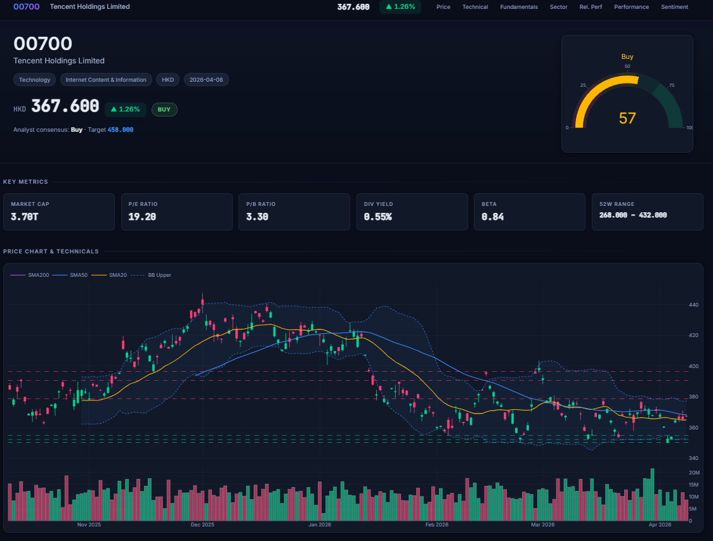
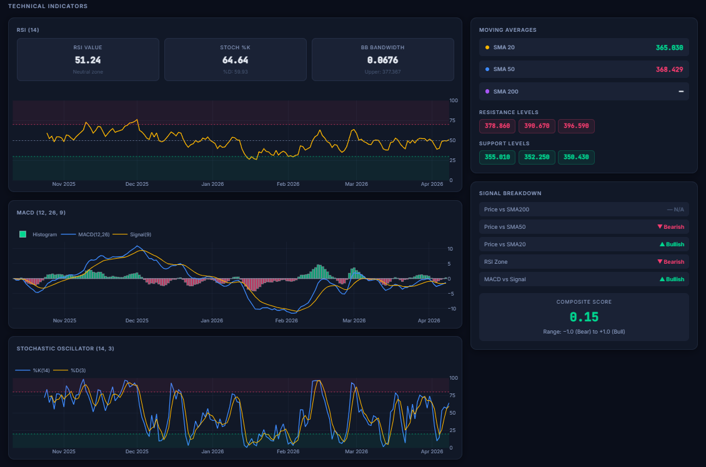
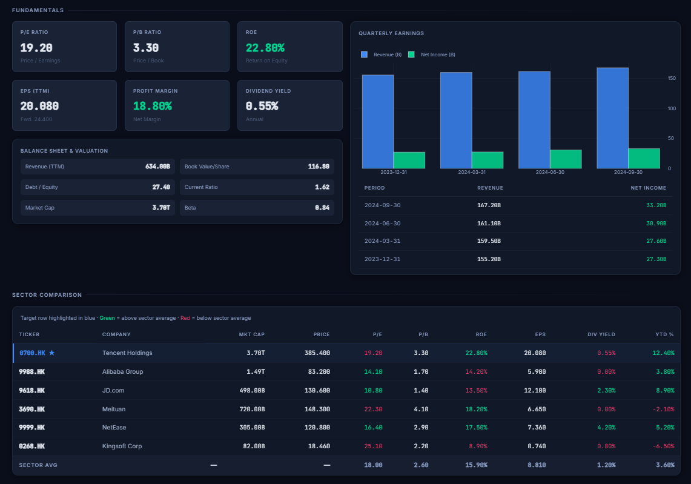
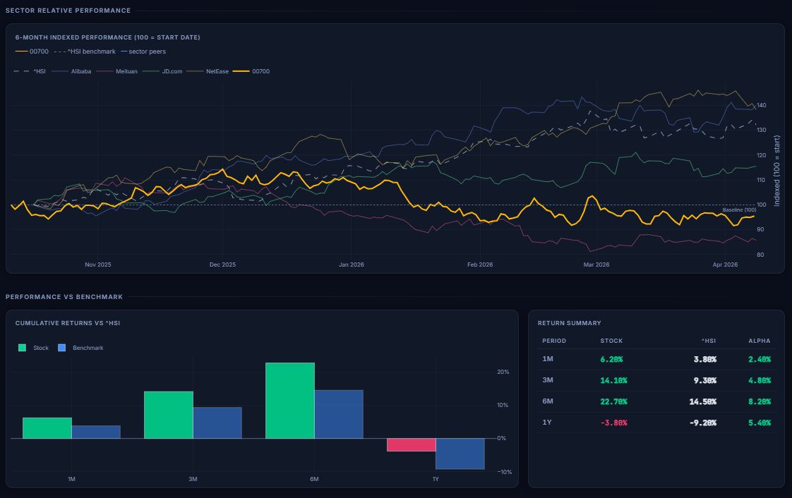
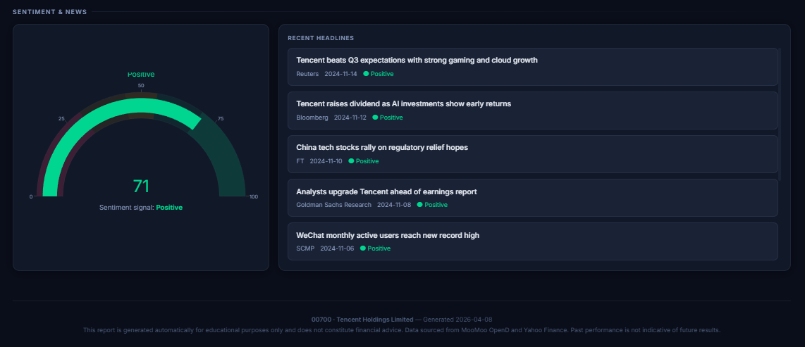

# equity-research-agent

*NTU MSc Applied AI · CA6115 course project · solo subproject*

An **MCP-based equity research agent**. Input a ticker → an orchestrated pipeline calls three MCP servers (market data, fundamentals, news + sentiment), runs technical analysis, and produces an 8-section interactive HTML research report. Built as a Claude Code skill, with a parallel standalone CLI mode that runs the full pipeline without Claude or MCP.

**[▶ View Live Sample Report (Tencent / HK.00700)](https://natbrian.github.io/auto-research-finance/moomoo-dashboard/outputs/US_AAPL_2026-04-08_report.html)**



---

## Architecture

```
User runs /moomoo-dash HK.00700                python -m src.orchestrator HK.00700
          │                                                  │
          ▼                                                  │
    Claude Code (skill orchestration)                        │
          │                                                  │
    ┌─────┴──────────────────────────┐                       │
    │                                │                       │
    ▼                                ▼                       │
moomoo_server              financials_server                 │
(MooMoo OpenD,             (yfinance: fundamentals,          │
 yfinance fallback)         earnings, peers, performance)    │
    │                                │                       │
    └──────────┬─────────────────────┘                       │
               │                                             │
               ▼                                             │
    news_sentiment_server                                    │
    (yfinance news + keyword scoring)                        │
               │                                             │
               └─────────────────┬───────────────────────────┘
                                 ▼
                  src/technical_indicators.py
                  (RSI, MACD, Bollinger, SMA, Stochastic)
                                 │
                                 ▼
                  src/report_generator.py
                  (Jinja2 + Plotly → single HTML)
                                 │
                                 ▼
                  outputs/{TICKER}_{date}_report.html
```

The same data → analysis → report pipeline runs through two entry points: a Claude Code skill (`/moomoo-dash`) that orchestrates the three MCP servers via tool use, and a CLI orchestrator (`python -m src.orchestrator`) that talks to MooMoo OpenD and yfinance directly with no LLM in the loop.

---

## Notable design choices

- **Two execution modes**: the same pipeline runs both as a Claude Code skill (via MCP) and as a standalone CLI (`python -m src.orchestrator`). The CLI path keeps the system testable and debuggable without an LLM in the loop, and lets the report generator be reused outside agent contexts.
- **Graceful degradation with source tagging**: MooMoo OpenAPI is the primary market-data source, but US equities and several plate APIs require paid market rights. When MooMoo returns a permission error (`"no right"`, `"quota"`, `"subscription"`, …) or is unreachable, every relevant tool transparently falls back to yfinance, and every response carries a `"source": "moomoo" | "yfinance" | "moomoo_only"` field so the data origin remains inspectable downstream.
- **Three MCP servers, separated by responsibility**: market data, fundamentals, news + sentiment — each kept thin and composable rather than rolled into one monolithic server. Servers register through `.claude.json`; skills declare which servers they need via `allowed-tools`.

The Claude Code skill (`.claude/skills/moomoo-dash/SKILL.md`) acts as an **agent specification** describing the role, the tool-call sequence, the branching logic between data sources, and the error-handling table — making the agent's behavior auditable in version control, expressed as structured procedure rather than ad-hoc prompt strings.

---

## Quick Start

### Prerequisites

| Requirement | Notes |
|---|---|
| Python 3.10+ | Required for type hints and pandas 2.x |
| Claude Code CLI | Required only for skill mode (`/moomoo-dash`) |
| [MooMoo OpenD](https://www.moomoo.com/download/OpenAPI) | Local gateway for real-time data; optional — system falls back to yfinance |
| MooMoo Account | Optional. Free account provides HK LV1 data |

> **No setup required to view a sample.** Run `python scripts/generate_sample_report.py` to produce a complete report from canned data — useful for evaluating the project without any API access.

### Install

```bash
git clone https://github.com/nabeofchanKo/equity-research-agent.git
cd equity-research-agent
pip install -r requirements.txt
```

### View a sample report (no API access needed)

```bash
python scripts/generate_sample_report.py
# → opens outputs/SAMPLE_HK_00700_report.html
```

### Method 1 — Standalone CLI (no Claude, no MCP)

```bash
python -m src.orchestrator HK.00700
python -m src.orchestrator US.AAPL
python -m src.orchestrator NVDA          # US prefix inferred from non-numeric code
python -m src.orchestrator 00700         # HK prefix inferred from numeric code

# Custom output directory
python -m src.orchestrator HK.00700 --output-dir ./my-reports
```

The orchestrator connects to OpenD and yfinance directly. If MooMoo is unavailable or returns a permission error, it falls back to yfinance automatically and continues generating the report.

### Method 2 — Claude Code skill (agent mode)

```bash
cd equity-research-agent
claude
```

Then inside Claude Code:

```
/moomoo-dash HK.00700       # Full equity research report
/moomoo-dash 00700          # HK prefix inferred from numeric code
/moomoo-dash US.AAPL        # US stock (requires paid MooMoo data rights or yfinance fallback)

/moomoo-quote HK.00700      # Quick price + key metrics (text only)
/moomoo-sector HK.00700     # Sector peer comparison table
```

The skill calls the three MCP servers via Claude's tool-use protocol, runs analysis, and writes `outputs/{TICKER}_{date}_report.html`.

---

## What the report contains

The generated single-file HTML report includes 8 interactive sections:

| # | Section | Contents |
|---|---|---|
| 1 | **Header & Summary** | Company info, current price, daily change %, overall signal gauge |
| 2 | **Price Chart** | 6-month candlestick with SMA 20/50/200, Bollinger Bands, volume |
| 3 | **Technical Indicators** | RSI, MACD (with histogram), Stochastic, support/resistance levels |
| 4 | **Fundamentals** | P/E, P/B, ROE, EPS, margins + quarterly earnings bar chart |
| 5 | **Sector Comparison** | Peer ranking table with color-coded relative valuation |
| 5b | **Sector Relative Performance** | Indexed (100 = start) line chart: target vs peers vs benchmark |
| 6 | **Performance Benchmark** | Stock vs ^HSI (HK) or SPY (US) over 1M / 3M / 6M / 1Y |
| 7 | **Sentiment & News** | Sentiment gauge + recent headlines with per-article scores |

Screenshots from a sample report generated for **HK.00700 (Tencent Holdings)**:







---

## MCP Servers

Three MCP servers expose data as tools. They are registered in `.claude.json` and start automatically when Claude Code connects.

### `moomoo_server` — Real-time market data

Connects to MooMoo OpenD gateway. Provides live quotes, candlestick data, and sector/plate information. **Automatically falls back to yfinance** when MooMoo returns a permission error or connection error. Every response includes a `"source"` field: `"moomoo"`, `"yfinance"`, or `"moomoo_only"`.

| Tool | MooMoo fallback | Description |
|---|---|---|
| `get_snapshot(ticker)` | yfinance `Ticker.info` | Price, volume, P/E, P/B, 52W range, dividend yield |
| `get_kline(ticker, days, kline_type)` | yfinance `download()` | OHLCV candlestick data (default 180 days, daily) |
| `get_plate_list(market)` | none | All industry sector plates for a market |
| `get_plate_stocks(plate_code)` | none | All stocks in a sector plate |
| `get_plate_for_stock(ticker)` | yfinance sector + curated peers | Which plates/sector a stock belongs to |
| `get_multi_snapshot(tickers)` | yfinance per-ticker | Batch snapshots for peer comparison |

### `financials_server` — Fundamental data

Uses yfinance (Yahoo Finance). Works for both HK and US stocks.

| Tool | Description |
|---|---|
| `get_fundamentals(ticker)` | P/E, P/B, ROE, EPS, margins, beta, analyst target |
| `get_earnings(ticker)` | Last 4 quarters: revenue, net income, EPS |
| `get_peer_comparison(ticker, max_peers)` | Side-by-side fundamental comparison vs sector peers |
| `get_performance(ticker, benchmark)` | 1M/3M/6M/1Y cumulative returns vs index |

### `news_sentiment_server` — News & sentiment

Uses yfinance news feed + keyword-based sentiment scoring (intentionally simple — not an NLP model).

| Tool | Description |
|---|---|
| `get_news(ticker, days)` | Recent news articles with title, publisher, date, pre-scored sentiment |
| `score_sentiment(articles_json)` | Score a batch of articles; returns per-article and overall score |

---

## Skills

Each skill is a markdown file under `.claude/skills/` declaring role, allowed tools, input contract, step-by-step workflow, data-source fallback table, and error-handling rules. The skill files double as the agent's specification — diffable in Git, reviewable in PRs.

| Skill | Command | Description | Tools used |
|---|---|---|---|
| `moomoo-dash` | `/moomoo-dash <TICKER>` | Full equity research report (HTML) | All 3 servers |
| `moomoo-quote` | `/moomoo-quote <TICKER>` | Quick price + key metrics (text) | moomoo + financials |
| `moomoo-sector` | `/moomoo-sector <TICKER>` | Sector peer comparison table | moomoo + financials |

---

## Project Structure

```
equity-research-agent/
├── README.md
├── requirements.txt
├── setup.py
├── pytest.ini
├── .claude.json                    ← MCP server registration
├── config/settings.yaml
├── mcp_servers/
│   ├── moomoo_server/server.py     ← 6 MooMoo tools
│   ├── financials_server/server.py ← 4 yfinance tools
│   └── news_sentiment_server/server.py ← 2 sentiment tools
├── src/
│   ├── technical_indicators.py     ← RSI/MACD/BB/Stoch/SMA
│   ├── sector_mapper.py            ← Ticker format conversion + peer lookup
│   ├── report_generator.py         ← Jinja2 + Plotly HTML report
│   ├── orchestrator.py             ← CLI pipeline (no MCP needed)
│   └── utils.py
├── templates/report.html           ← Dark-theme Jinja2 template
├── scripts/
│   └── generate_sample_report.py   ← Generates outputs/SAMPLE_*.html
├── outputs/
│   └── SAMPLE_HK_00700_report.html ← Pre-generated sample
├── tests/
│   ├── test_utils.py
│   ├── test_technical_indicators.py
│   ├── test_sector_mapper.py
│   ├── test_financials_server.py
│   ├── test_moomoo_server.py
│   ├── test_report_generator.py
│   └── test_integration.py         ← @pytest.mark.integration
└── .claude/
    └── skills/
        ├── moomoo-dash/SKILL.md
        ├── moomoo-quote/SKILL.md
        └── moomoo-sector/SKILL.md
```

---

## Configuration

`config/settings.yaml`:

```yaml
moomoo:
  host: "127.0.0.1"
  port: 11111
  default_kline_days: 180

technical:
  sma_periods: [20, 50, 200]
  rsi_period: 14
  macd_fast: 12
  macd_slow: 26
  macd_signal: 9
  bollinger_period: 20
  bollinger_std: 2

sentiment:
  lookback_days: 7
```

---

## Running Tests

Unit and integration tests are separated by pytest marker so unit tests run with no network or external services.

```bash
# Unit tests only (no OpenD, no internet required)
pytest -m "not integration" -q

# All tests including integration (OpenD + internet required)
pytest -m integration -v

# Single test file
pytest tests/test_technical_indicators.py -q
pytest tests/test_report_generator.py -q
```

---

## Tech Stack

| Layer | Technology | Purpose |
|---|---|---|
| Agent harness | Claude Code | Skill orchestration, tool-use protocol |
| MCP framework | mcp Python SDK (FastMCP) | Tool server protocol |
| Market data | moomoo-api (Python SDK) | Real-time quotes, K-line, sector plates |
| Fundamentals | yfinance | P/E, ROE, earnings, peer data |
| Analysis | pandas, numpy | Technical indicator computation |
| Charts | Plotly | Interactive embedded charts |
| Templating | Jinja2 | HTML report generation |
| Sentiment | yfinance news + keyword scoring | News retrieval + scoring |
| Testing | pytest | Unit + integration tests (separated by marker) |

---

## Project Context

This repository began as a subproject of **CA6115 (NTU MSc Applied AI)** — a team course project building Claude Code-based research tooling for finance. `equity-research-agent` (originally named `moomoo-dashboard`) was my solo subproject within that course, and this repository extracts it for standalone use with full commit history preserved via `git filter-repo`.

The original team repository, which contains three other complementary projects by other team members (a paper-to-factor pipeline, a multi-agent trading system, and an alternate stock-insight reporter), is at [auto-research-finance](https://github.com/NatBrian/auto-research-finance).

The framing for the work overall is **harness engineering**: the LLM (via Claude Code) handles most of the keystroke-level implementation, while design judgment — tool boundaries, fallback strategy, state contracts, scoring rules, test layering, and review/correction loops — is owned by the engineer outside the model. The skill files under `.claude/skills/` are written as agent specifications precisely so this design surface is explicit and reviewable.

---

## Disclaimer

This system is for **research and educational purposes only**. It is not financial advice. Past performance does not guarantee future results.
